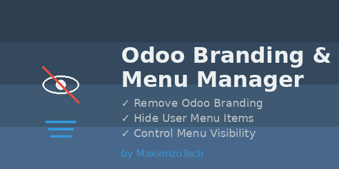

# Odoo Branding & Menu Manager

## Overview

**Odoo Branding & Menu Manager** is a comprehensive interface customization application professionally developed by **MaximizoTech** designed for Odoo 18. It provides exceptional branding control and granular menu management capabilities. This module is essential for white-label deployments, client-specific installations, and creating a simplified, distraction-free user interface tailored to your exact business needs.

##  Key Features

### 1.  White-Label Your Odoo (Remove Odoo Branding)
- **Login Page Cleanup:** Automatically hides the "Powered by Odoo" text from the login interface.
- **Database Management:** Removes the "Manage Databases" link (optional) for enhanced security and cleaner presentation.
- **Professional Appearance:** Delivers a fully white-labeled login experience out-of-the-box.

### 2.  Streamlined User Menu
Automatically cleans up the top-right user dropdown menu to prevent users from navigating to unnecessary external links. Effectively removes:
- Documentation link
- Support link
- Shortcuts menu
- Odoo Account link
- Install PWA option
- Unnecessary separators and tour options

### 3.  Advanced Per-User Menu Visibility
Gain full control over what each user sees in their Odoo instance without complex security rules or uninstalling modules:
- **Granular Control:** Hide specific module apps or menu items on a per-user basis.
- **Easy Configuration:** Manage restrictions directly from the user's form view under the new "Hide Specific Menu" tab.
- **Visibility Tracking:** Check which users are restricted from viewing a specific menu directly from the menu item's form.
- **Admin Bypass:** System administrators automatically bypass all restrictions, ensuring uninterrupted system management.

##  Installation

1. Copy the `mx_odoo_interface` module folder to your Odoo `custom_addons` directory.
2. Restart your Odoo server instance.
3. Activate the **Developer Mode** in Odoo.
4. Navigate to **Apps** and click on **Update Apps List**.
5. Search for **Odoo Branding & Menu Manager** and click **Install**.

##  Configuration & Usage

### Hiding Menus for Specific Users

1. Navigate to **Settings -> Users & Companies -> Users**.
2. Select the internal user you wish to restrict (Note: System Administrators cannot be restricted).
3. Open the **"Hide Specific Menu"** tab.
4. Add the menu items you want to hide from this specific user.
5. Save the user record. Upon their next login or page refresh, the selected menus will be completely hidden from their interface.

### Tracking Restricted Users

1. Navigate to **Settings -> Technical -> User Interface -> Menu Items**.
2. Open any menu item record.
3. Open the **"Restricted Users"** tab to view a complete list of users who cannot see this menu.

### Branding & Cleanup

- **Login Branding:** Removed automatically upon module installation. No additional configuration is required.
- **User Menu Cleanup:** Unnecessary links in the top right user menu are removed immediately upon installation.

##  Technical Details

- **Module Name:** `mx_odoo_interface`
- **Supported Odoo Version:** 18.0
- **Dependencies:** `base`, `web`
- **Extended Models:** `res.users`, `ir.ui.menu`
- **Key Overrides:** 
  - Overrides `ir.ui.menu._filter_visible_menus()` for safe and seamless backend access control.
  - Patches OWL component `UserMenu` using Odoo 18 JavaScript architecture to streamline the frontend dropdown.

##  Support & Services

This module is professionally developed, maintained, and authorized by **MaximizoTech**. 

For technical support, custom feature requests, or enterprise Odoo development services, please reach out to us:
- **Website:** [https://maximizotech.com](https://maximizotech.com)
- **Email:** contact@maximizotech.com
- **Author:** MaximizoTech

---
*Authorized and published by MaximizoTech. All rights reserved.*

*Built and maintained by MaximizoTech. Portions inspired by open-source Odoo community tools.*
